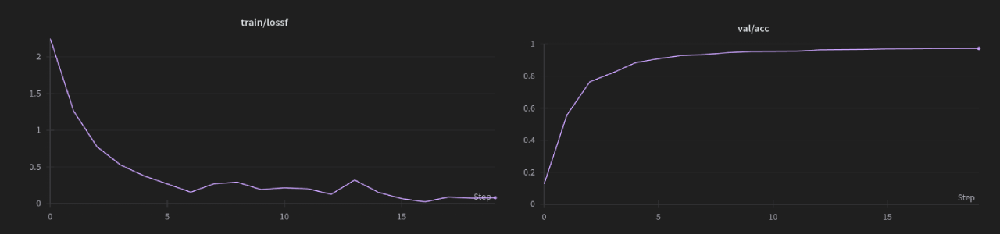

# microViT


# Index

1. [Project Overview](#project-overview)
2. [Installation](#installation)
3. [Training](#training)
5. [Credits](#credits)

## Project Overview

A simple ViT implementantion for training and evaluating a
ViT model. The model can be trained on a single GPU in 
a less than an hour in consumer GPUs. The repository is structured as follows:

```
├── config.py <- ViT configuration
|
├── model.py <- ViT model, inference and evaluation ~200 lines
|
└── train.py <- training the model ~150 lines
```

Our model is based on the raw implementation of the ViT model, with the encoder part. The task we will be working on is the numbers classification task for [MNIST dataset](https://en.wikipedia.org/wiki/MNIST_database). 

During the training you will see how the model converges: the loss will decrease and the accuracy will increase.



## Installation

```bash
pip install torch torchvision transformers wandb
```

Dependencies:
- [pytorch](https://pytorch.org/): Define the ViT model
- [transformers](https://huggingface.co/transformers/): Cosine lr scheduler
- [wandb](https://wandb.ai/): Logging the training process


## Training

The training can be started with the following command:

```bash
python train.py
```

This will start the training with the default parameters. You can change the parameters in the `config.py` file and the `train.py` file. The training will be logged on [wandb](https://wandb.ai/). At the end of the training, the model will be saved in a `checkpoints` folder.


## Credits

- My [blog post](https://aidventure.es/blog/vit/) on the ViT model. 